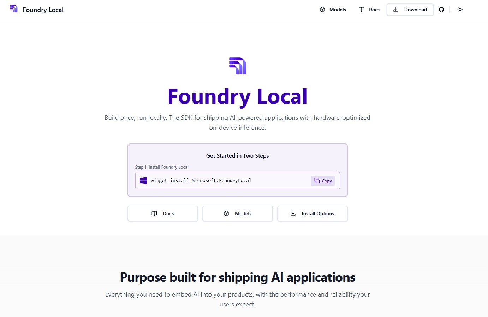
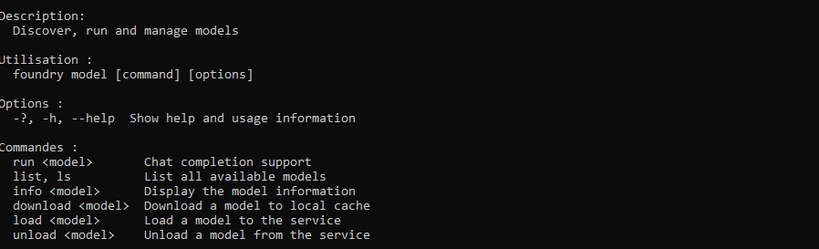
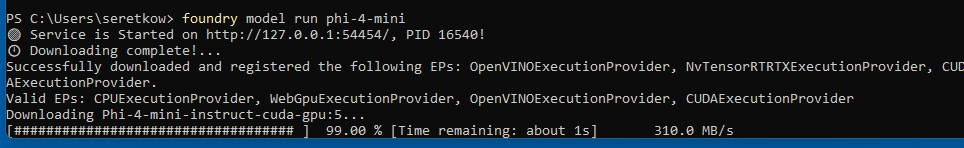
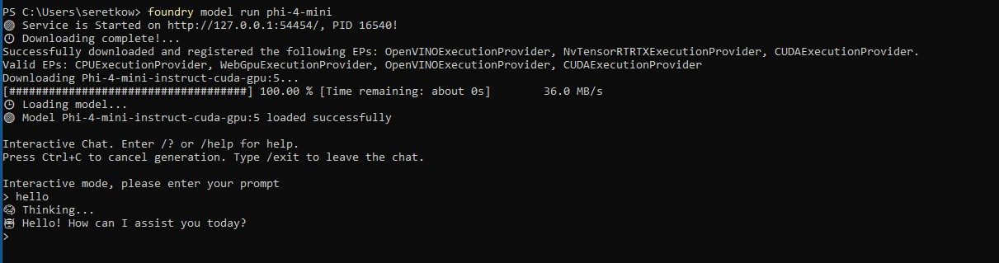
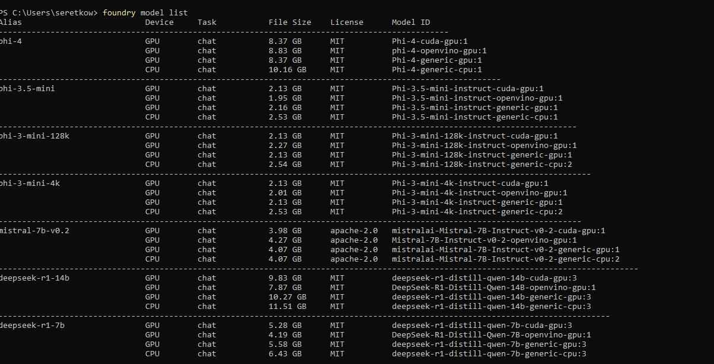
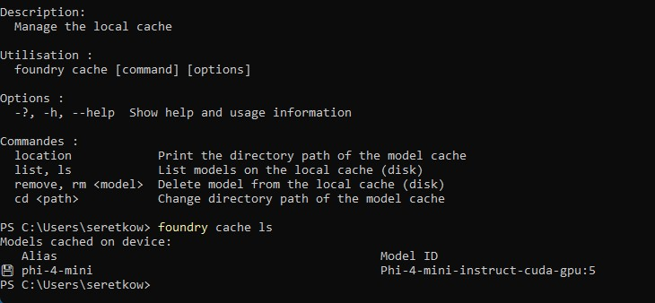

# Foundry Local 🚀

<p align="center">
  
</p>

**Foundry Local** is an on-device AI inference solution that lets you run AI models locally through a **CLI**, **SDK**, or **REST API**. This repository provides a collection of Jupyter Notebook tutorials to help you get started and explore advanced capabilities.

🌐 **Website**: [www.foundrylocal.ai](https://www.foundrylocal.ai/)

---

## 📚 Notebooks

| # | Notebook | Description |
|---|----------|-------------|
| 01 | [Getting Started with Foundry Local](01%20Getting%20Started%20with%20Foundry%20Local.ipynb) | Introduction to Foundry Local — installation, setup, and running your first local model |
| 02 | [Foundry Local Chat Completions](02%20Foundry%20Local%20chat%20completions.ipynb) | Using the chat completions API to interact with local models |
| 03 | [Foundry Local Practical Applications](03%20Foundry%20Local%20Practical%20Applications.ipynb) | Real-world use cases and practical examples with Foundry Local |
| 04 | [Foundry Local Mistral 7B](04%20Foundry%20Local%20Mistral7b.ipynb) | Running and interacting with the Mistral 7B model locally |
| 05 | [Advanced Function Calling with Foundry Local](05%20Advanced%20Function%20Calling%20with%20Foundry%20Local.ipynb) | Implementing advanced function calling and tool use with local models |
| 06 | [Deploying Custom Models with Microsoft Olive and Foundry Local](06%20Deploying%20Custom%20Models%20with%20Microsoft%20Olive%20and%20Foundry%20Local.ipynb) | Optimizing and deploying custom models using Microsoft Olive |

---

## 🖼️ Screenshots

<p align="center">
  <br/><br/>
  <br/><br/>
  <br/><br/>
  <br/><br/>
  
</p>

---

## ⚙️ Getting Started

### Prerequisites

- **Python 3.10+**
- **Foundry Local** installed — see [foundrylocal.ai](https://www.foundrylocal.ai/) for installation instructions
- **Jupyter Notebook** or **JupyterLab**

### Installation

1. Clone this repository:
   ```bash
   git clone https://github.com/retkowsky/foundry-local.git
   cd foundry-local
   ```

2. Install the required Python packages:
   ```bash
   pip install -r requirements.txt
   ```

3. Launch Jupyter and open any notebook:
   ```bash
   jupyter notebook
   ```

---

## 🔑 Key Dependencies

| Package | Purpose |
|---------|---------|
| `foundry-local` | Core Foundry Local package |
| `foundry-local-sdk` | Foundry Local Python SDK |
| `openai` | OpenAI-compatible API client |
| `onnxruntime` / `onnxruntime-genai` | ONNX Runtime for model inference |
| `olive-ai` | Microsoft Olive for model optimization |
| `transformers` | Hugging Face Transformers |
| `torch` | PyTorch |

---

## 🏷️ Topics

`edge` · `foundry-local` · `genai` · `microsoft` · `microsoft-foundry`

---

## 📄 Resources

- 🌐 [Foundry Local Website](https://www.foundrylocal.ai/)
- 📖 [Foundry Local Documentation](https://www.foundrylocal.ai/)
- 📊 [Available Models](models.xlsx)